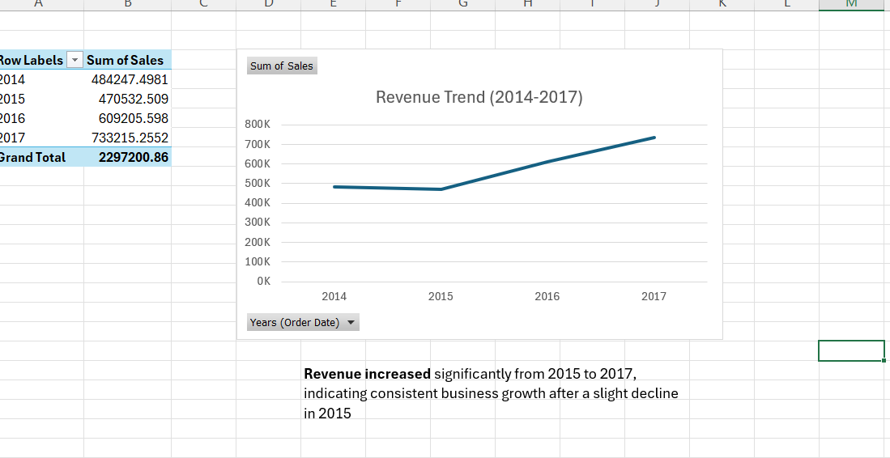
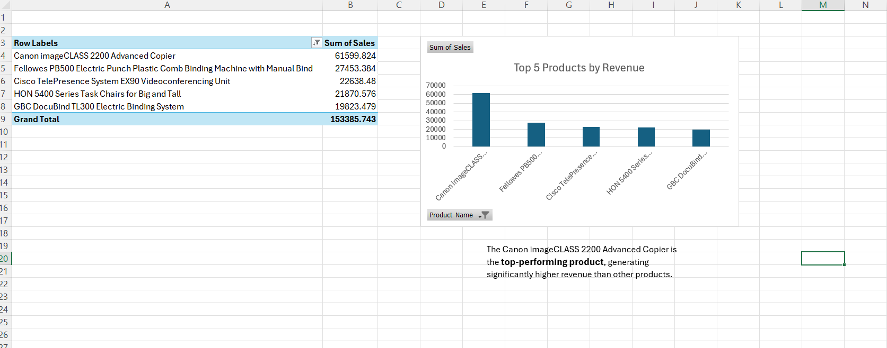
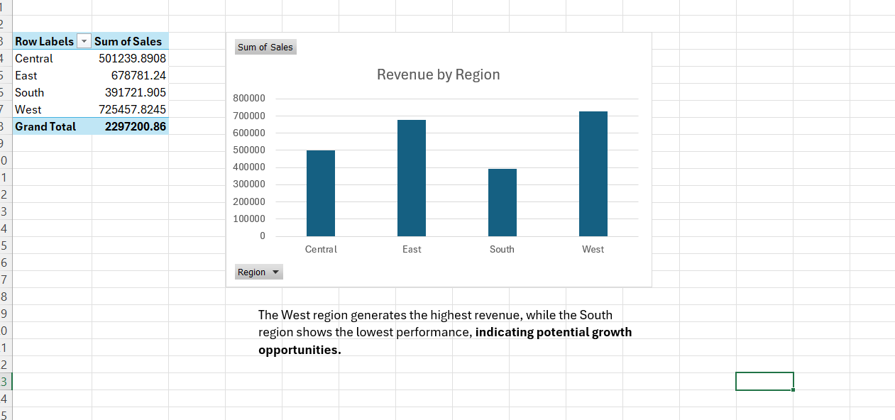

# 📊 Sales Data Analysis Project

## 📌 Overview

This project analyzes sales data using Microsoft Excel to identify key business insights, including revenue trends, top-performing products, and regional performance.

---

## 📁 Dataset

* Sample Superstore dataset
* Contains sales data across years, regions, and products

---

## 📈 Analysis & Visualizations

### 1️⃣ Revenue Trend (2014–2017)

**Insight:**
Revenue increased significantly from 2015 to 2017, indicating strong business growth after a slight dip in 2015.

---

### 2️⃣ Top 5 Products by Revenue

**Insight:**
The Canon imageCLASS 2200 Advanced Copier is the top-performing product, generating significantly higher revenue than others.

---

### 3️⃣ Revenue by Region

**Insight:**
The West region generates the highest revenue, while the South region shows the lowest performance, suggesting potential growth opportunities.

---

## 🛠 Tools Used

* Microsoft Excel (Pivot Tables, Charts)

---

## 📂 Files Included

* `Sample - Superstore.xlsx` → dataset & analysis
* `RevenueTrends.png` → trend chart
* `ProductsByRevenue.png` → top products chart
* `RevenueByRegion.png` → regional chart

---

## 👩‍💻 Author
Leen Qandeel.

